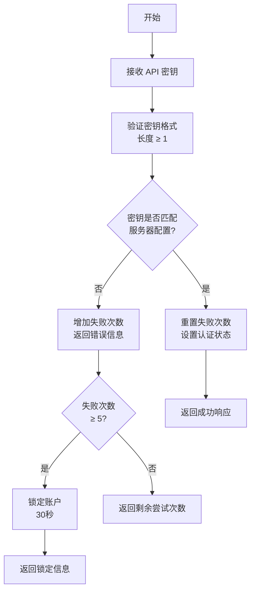
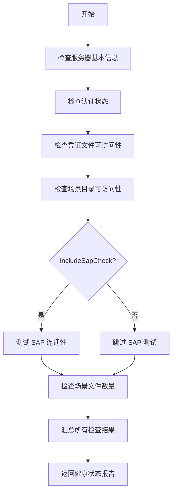
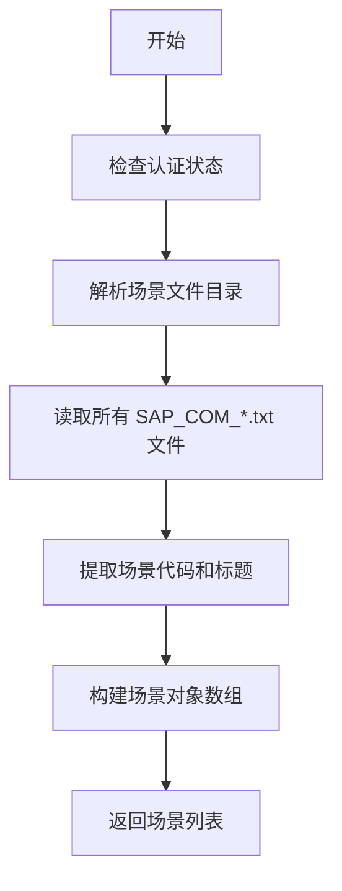
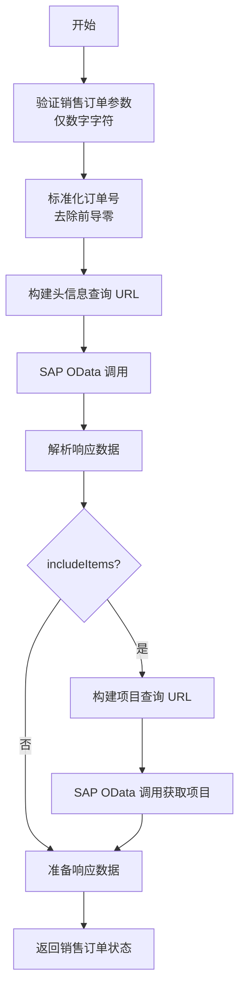
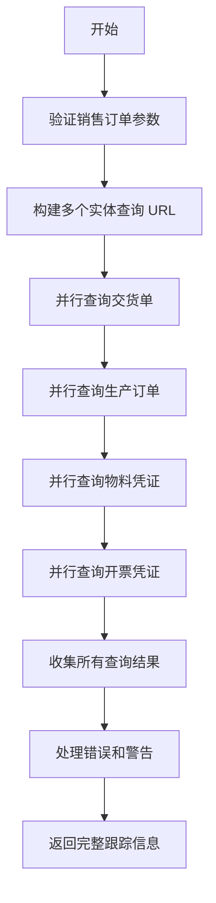
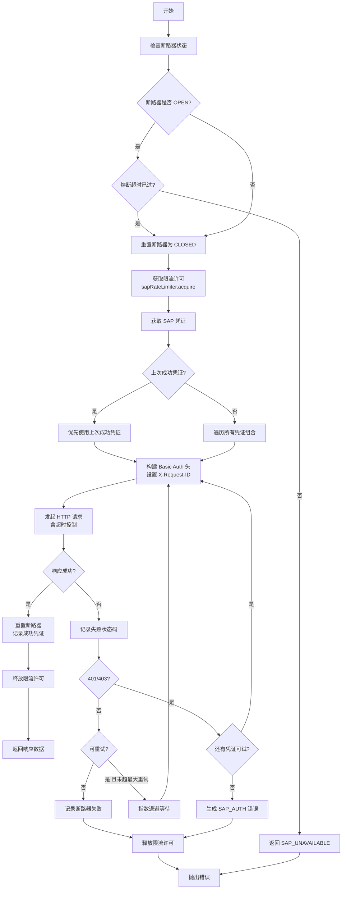
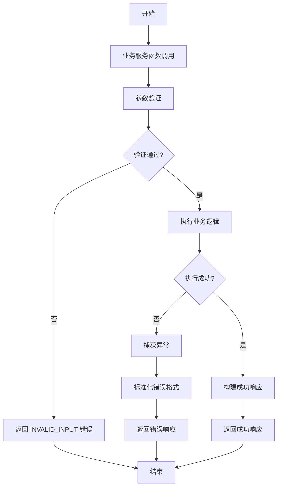
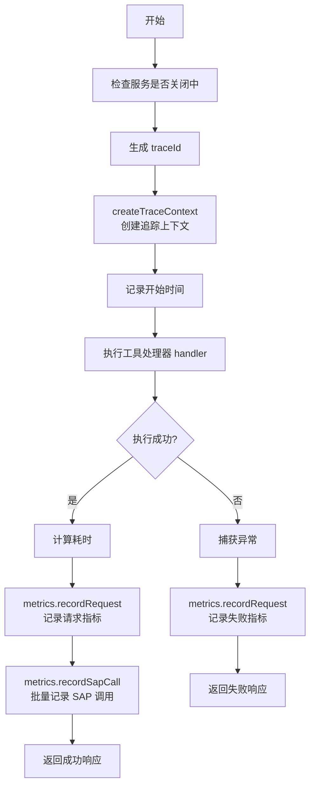
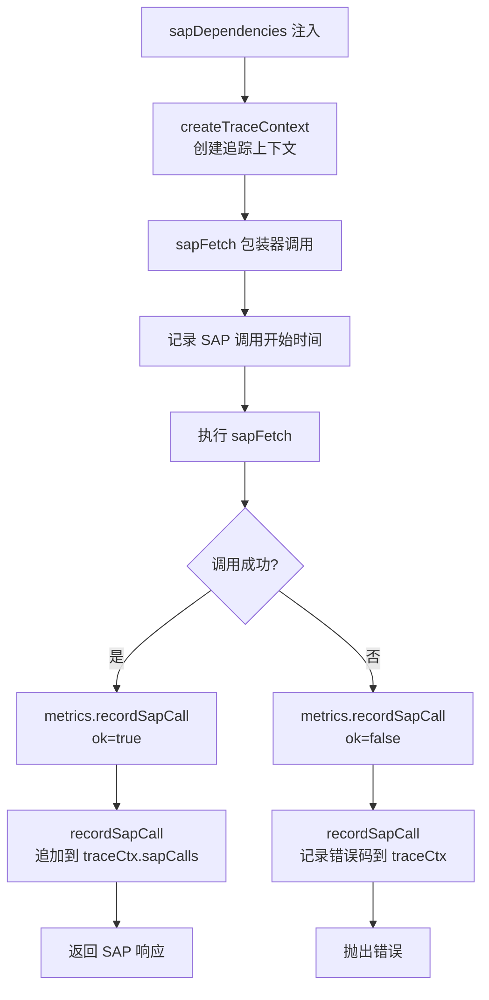
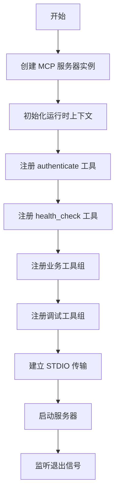

# 业务逻辑说明

本文档详细说明 MCP Server 中各业务服务的逻辑流程。

## 1. 认证流程

### authenticate 工具



### 认证状态管理
- 服务器启动时初始化认证上下文
- 认证成功后设置 `authenticated` 标志
- 所有受保护工具都需要先检查认证状态

## 2. 健康检查流程

### health_check 工具



## 3. SAP 场景管理

### list_sap_scenarios 工具



### 场景解析逻辑
- 从 `SAP_SCENARIO_DIR` 目录读取所有 `.txt` 文件
- 识别文件名中的 `SAP_COM_XXXX` 模式
- 提取文件中的 URL 并验证主机合法性
- 生成标准化的场景键名

## 4. 销售订单处理

### get_sales_order_status 工具



### trace_sales_order 工具



## 5. SAP 核心交互

### sapFetch 函数（含限流 + 断路器）



### 凭证管理策略
- 缓存凭证文件内容（基于修改时间变化检测）
- 优先使用上次成功的凭证组合
- 自动轮询所有可能的用户名/密码组合
- 实现请求超时控制

## 6. 业务服务模块

### 通用业务服务模式

所有业务服务模块（services/ 目录）遵循相同的模式：

1. **参数验证** - 验证输入参数的有效性
2. **URL 构建** - 基于参数构建 SAP OData 查询 URL
3. **SAP 调用** - 通过 sapFetch 函数执行查询
4. **数据处理** - 解析和标准化响应数据
5. **错误处理** - 统一的错误格式化

### 错误处理策略



## 7. 响应格式标准化

### 统一响应结构

所有工具返回相同格式的 JSON 响应：

```json
{
  "schemaVersion": "1.0",
  "tool": "tool-name",
  "ok": true/false,
  "data": {}, // 业务数据
  "warnings": [], // 警告信息
  "error": {} // 错误信息（仅失败时）
}
```

### 响应生成函数

- `toolSuccess()` - 生成成功响应
- `toolFailure()` - 生成失败响应
- `textJson()` - 将响应包装为 MCP 文本内容格式

## 8. 可观测性集成

### 请求包装器（wrapTool）



### SAP 调用追踪



### 模块结构
- `lib/observability.js` — `generateTraceId`, `createTraceContext`, `recordSapCall`, `MetricsStore`
- `wrapTool()` — MCP 工具请求级别的追踪包装器
- `sapDependencies()` — 注入到业务服务模块的 SAP 调用包装器，负责指标记录和链路追踪

## 9. 运行时上下文

### 上下文隔离
- `createRuntimeContext()` 创建独立的运行时上下文
- 每个实例拥有独立的认证和 SAP 状态
- 支持未来 HTTP/SSE 会话扩展

## 10. 工具注册流程

### MCP 服务器初始化



### 工具注册模式
- 使用 `server.tool()` 方法注册每个工具
- 每个工具包含名称、描述、参数模式和处理器
- 所有工具处理器通过 `wrapTool()` 包装以获得统一的可观测性